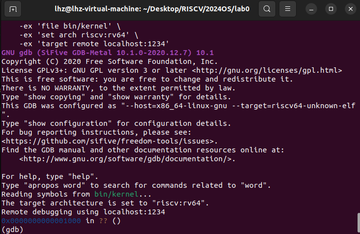

# Lab0.5 最小可执行内核
## 一.实验目的
实验0.5主要讲解最小可执行内核和启动流程。我们的内核主要在 Qemu 模拟器上运行，它可以模拟一台 64 位 RISC-V 计算机。为了让我们的内核能够正确对接到 Qemu 模拟器上，需要了解 Qemu 模拟器的启动流程，还需要一些程序内存布局和编译流程（特别是链接）相关知识,以及通过opensbi固件来启动服务。

1.了解内存布局与链接脚本

链接脚本是内核内存布局的核心，通过它我们可以定义代码、数据、堆栈等在内存中的位置。本实验我们将学习到如何编写链接脚本来描述内核的内存布局。

2.使用交叉编译生成内核镜像

因为我们是在一个非RISC-V的系统上开发RISC-V内核，所以需要使用交叉编译工具链，将C或汇编代码编译为RISC-V平台的可执行文件。接下来，我们将链接生成内核镜像，作为最终在Qemu上运行的可执行文件。

3.使用OpenSBI加载内核镜像

OpenSBI是一个RISC-V的固件规范，它充当bootloader，负责引导内核。我们将使用OpenSBI来加载并启动生成的内核镜像。

4.使用Qemu模拟器并进行内核调试

Qemu模拟器可以精确模拟RISC-V架构计算机的硬件环境。通过配置Qemu，你将能够模拟系统启动，并运行自己的内核镜像。同时，通过OpenSBI提供的服务，在屏幕上格式化打印字符串，将帮助我们进行内核调试。

## 二.实验过程

### 练习1:启动GDB验证启动流程

*为了熟悉使用qemu和gdb进行调试工作,使用gdb调试QEMU模拟的RISC-V计算机加电开始运行到执行应用程序的第一条指令（即跳转到0x80200000）这个阶段的执行过程，说明RISC-V硬件加电后的几条指令在哪里？完成了哪些功能？要求在报告中简要写出练习过程和回答。*

#### 1.启动QEMU并连接GDB 

首先通过make debug指令启动QEMU模拟器，随后使用make gdb指令启动GDB并连接到QEMU。
```bash
make debug
make gdb
```



**由上图可以看出，QEMU模拟器启动后程序计数器（PC）首先停在了0x1000**。这是因为在RISC-V架构中，计算机上电复位会将系统的各个组件（如处理器、内存和外设）初始化到默认状态，随后启动Bootloader。在QEMU模拟的环境下，**PC被初始化为0x1000，说明这是系统的复位地址**，通常用于加载引导程序（如OpenSBI），负责初始化硬件并最终将控制权转交给内核镜像。

2.进入gdb中，使用命令`x/10i $pc`查看0x1000处的10条汇编指令。

```bash
0x0000000000001000 in ?? ()
(gdb) x/10i $pc
=> 0x1000:	auipc	t0,0x0
   0x1004:	addi	a1,t0,32
   0x1008:	csrr	a0,mhartid
   0x100c:	ld	t0,24(t0)
   0x1010:	jr	t0
   0x1014:	unimp
   0x1016:	unimp
   0x1018:	unimp
   0x101a:	0x8000
   0x101c:	unimp
(gdb) si
0x0000000000001004 in ?? ()
(gdb) si
0x0000000000001008 in ?? ()
(gdb) si
0x000000000000100c in ?? ()
(gdb) si
0x0000000000001010 in ?? ()
(gdb) si
0x0000000080000000 in ?? ()

```

首先通过`auipc t0, 0x0`指令将PC的当前值加上0x0偏移量，并将结果结果存入t0寄存器。这是对当前地址进行一次基址计算，用于后续地址操作。

接着通过`addi a1, t0, 32`指令将t0寄存器的值加上32，并存入a1寄存器。

`csrr a0, mhartid`指令从mhartid寄存器（表示硬件线程ID，类似于CPU核的编号）加载值到a0，用于多核系统中识别当前核。

`ld t0, 24(t0)`指令从t0寄存器指向的内存地址（偏移24字节处）加载64位数据到t0。

`jr t0`指令跳转到寄存器 t0 指向的地址，并且实验中可以看到，当单步执行到0x1010即跳转指令时pc跳转到了0x80000000，表明**此时t0寄存器指向的地址就是0x80000000。**

`unimp`指令为当前未实现的指令，表示无效或未定义的操作，通常作为占位符。

`0x8000`为直接的立即数。

该段代码是计算机上电后运行的启动引导代码的一部分。它首先通过auipc和addi进行地址计算，并通过mhartid获取当前硬件线程ID。随后，ld指令从内存中加载跳转地址，并通过jr指令跳转到该地址。在实验中，PC跳转到了物理地址0x80000000，表明此时系统跳转到了引导程序（Bootloader）的入口处，准备进行内核的进一步启动。

接下来我们通过`si`命令继续进行逐行调试，最后通过`jr t0`跳转到了物理地址 0x80000000 对应的指令处，即Bootloader的入口，准备进行内核的进一步启动。

#### 2.跳转到OpenSBI，观察内核启动流程

进入到`0x80000000`后，使用命令`x/10i $pc`查看接下来的10条汇编指令。

```bash
(gdb) si
0x0000000080000000 in ?? ()
(gdb) x/10i $pc
=> 0x80000000:	csrr	a6,mhartid
   0x80000004:	bgtz	a6,0x80000108
   0x80000008:	auipc	t0,0x0
   0x8000000c:	addi	t0,t0,1032
   0x80000010:	auipc	t1,0x0
   0x80000014:	addi	t1,t1,-16
   0x80000018:	sd	t1,0(t0)
   0x8000001c:	auipc	t0,0x0
   0x80000020:	addi	t0,t0,1020
   0x80000024:	ld	t0,0(t0)
```

`csrr a6, mhartid`指令从mhartid寄存器中获取当前硬件线程ID（核ID），存入a6寄存器。

`bgtz a6, 0x80000108`指令判断如果a6寄存器中的值大于零（即核ID非0），则跳转到地址0x80000108。

`auipc t0, 0x0`指令将当前的PC值加上一个偏移量（0x0），并将结果存储在t0寄存器中。

`addi t0, t0, 1032`指令将t0寄存器的值加上 1032，并将结果存储在 t0 寄存器中。

`auipc t1, 0x0`指令将当前的PC值加上一个偏移量（0x0），并将结果存储在t1寄存器中。

`addi t1, t1, -16`指令将t1寄存器的值减去 16，并将结果存储在t1寄存器中。

`sd t1, 0(t0)`指令将t1寄存器的值存储到t0寄存器指向的内存地址。

`auipc t0, 0x0`指令将当前的PC值加上一个偏移量（0x0），并将结果存储在t0寄存器中。

`addi t0, t0, 1020`指令将t0寄存器的值加上 1020，并将结果存储在t0寄存器中。

`ld t0, 0(t0)`指令将t0寄存器指定地址的内存内容加载到t0寄存器。

`0x80000000`到`0x80000024`这部分代码是OpenSBI固件启动流程的一部分。OpenSBI是RISC-V架构上的一个固件层，负责在内核启动之前完成必要的系统初始化工作，提供基本的运行环境。在进入内核之前，OpenSBI会根据硬件线程（hart）的编号执行不同的初始化操作。主核通常负责加载和启动内核，而其他辅助核可能会处于等待或其他预备状态，直到主核完成初始化。**这些指令主要完成内核启动前的地址准备工作和多核环境下的调度。代码中的跳转操作会最终引导主核进入实际的操作系统内核加载阶段，即将控制权交给内核启动代码。**

#### 3.内核镜像启动

首先设置断点 通过GDB在内核入口处0x80200000设置断点，确保调试时QEMU会暂停在内核第一条指令处。接着开始执行并观察指令，使用continue命令让QEMU模拟器运行，直到碰到断点。此时，QEMU会暂停在地址0x80200000，这是内核的入口地址。进入到`0x80200000`后，使用命令`x/10i $pc`查看接下来的10条汇编指令。
```bash
(gdb) break *0x80200000
Breakpoint 1 at 0x80200000: file kern/init/entry.S, line 7.
(gdb) continue
Continuing.

Breakpoint 1, kern_entry () at kern/init/entry.S:7
7	    la sp, bootstacktop
(gdb) x/10i $pc
=> 0x80200000 <kern_entry>:	auipc	sp,0x3
   0x80200004 <kern_entry+4>:	mv	sp,sp
   0x80200008 <kern_entry+8>:	j	0x8020000a <kern_init>
   0x8020000a <kern_init>:	auipc	a0,0x3
   0x8020000e <kern_init+4>:	addi	a0,a0,-2
   0x80200012 <kern_init+8>:	auipc	a2,0x3
   0x80200016 <kern_init+12>:	addi	a2,a2,-10
   0x8020001a <kern_init+16>:	addi	sp,sp,-16
   0x8020001e <kern_init+20>:	li	a1,0
   0x8020001c <kern_init+18>:	sub	a2,a2,a0
```

`auipc sp, 0x3`指令将当前程序计数器（PC）加上一个偏移量0x3，并将结果存储在栈指针寄存器 sp 中。

`mv sp, sp`:指令将sp寄存器的值复制给sp寄存器，没有进行实质性的操作。

`j 0x8020000a <kern_init>`指令跳转到地址0x8020000a，开始执行kern_init函数，进行内核的初始化操作。
	
`auipc a0, 0x3`指令将当前PC加上偏移量0x3，结果存入a0寄存器，通常用于地址计算，准备后续操作。

`addi a0, a0, -2`指令将a0寄存器的值减2，并将结果存储在a0寄存器中。

`auipc a2, 0x3`指令将当前PC加上偏移量（0x3），并将结果存储在a2寄存器中。

`addi a2, a2, -10`指令将a2寄存器的值减10，并将结果存储在a2寄存器中。

`addi sp, sp, -16`指令将sp寄存器的值减去 16，并将结果存储在sp寄存器中，调整栈指针，为后续的栈操作分配空间。

`li a1, 0`指令将常量0加载到a1寄存器。

`sub a2, a2, a0`指令将a2寄存器的值减去a0寄存器的值，并将结果存储在a2寄存器中。

**这段代码是OpenSBI启动后进入内核阶段并顺利初始化的关键部分，涉及到内核的初始化工作。在执行这些指令后，内核已经正式开始了其执行过程，并为后续的功能和系统资源设置做了重要准备**。通过逐行调试，我们能够详细观察到内核如何通过这些指令逐步构建其运行环境，设置栈空间，计算参数，并为后续的系统调用与功能执行打下基础。最终，这些步骤将确保内核能在多核处理器环境中顺利运行并执行其核心功能。

## 三.实验中的知识点

# lab1 断,都可以断

## 一、实验目的

实验1 主要讲解的是中断处理机制。通过本章的学习，我们了解了riscv 的中断处理机制、相关寄存器与指令。我们知道在中断前后需要恢复上下文环境，用一个名为中断帧（TrapFrame）的结构体存储了要保存的各寄存器，并用了很大篇幅解释如何通过精巧的汇编代码实现上下文环境保存与恢复机制。最终，我们通过处理断点和时钟中断验证了我们正确实现了中断机制。

1.RISC-V 中断相关知识：

理解RISC-V架构中的中断机制，包括中断的类型、优先级及其工作原理。

2.上下文环境的保存与恢复：

学习如何在发生中断前保存当前执行环境，以便在中断处理完成后能够准确恢复原来的状态，包括寄存器和程序计数器等信息。

3.处理简单的断点中断和时钟中断：

掌握如何响应和处理最基本的中断类型，如断点中断（用于调试）和时钟中断（用于定时任务调度），并通过实践增强对中断处理机制的理解。

## 二、实验过程

### 1.练习1
`kern/init/entry.S`内容代码是**操作系统内核启动过程中初始化栈和跳转到内核初始化函数的关键步骤**。这段代码的目的是在内核启动时设置栈指针并跳转到内核初始化函数。在操作系统启动时，栈是必需的，它为函数调用、变量存储等提供支持。la sp, bootstacktop 指令将栈指针指向栈顶部，而 tail kern_init则将执行流跳转到内核初始化逻辑。这些步骤为内核启动提供了基础环境。**下面是两条关键指令的具体分析：**

1.`la sp, bootstacktop`
**完成的操作**：该指令将bootstacktop的地址加载到栈指针sp寄存器中，初始化内核的栈。bootstacktop是栈的顶部地址，加载后，内核可以使用这个栈进行函数调用、局部变量存储等操作，可以用于执行bootloder的一些基本操作。

**目的**：这是为内核设置一个专用栈空间，栈的地址由 bootstacktop 确定，确保内核在执行时有独立的栈来处理任务。

2.`tail kern_init`
**完成的操作**：该指令是一个跳转指令，控制流将转移到kern_init函数。tail表示尾调用，它意味着这次跳转不会返回到调用者（kern_entry）。内核初始化的主要逻辑在kern_init函数中，内核通过这一跳转开始执行其主要初始化工作。

**目的**：跳转到 kern_init，开始内核初始化，加载其他必要的系统资源和模块。

### 2.练习2
时钟中断处理是操作系统中断处理的一个重要部分，它负责周期性地触发中断，以维护系统时间和执行其他定时任务。在本次实验中，我们实现了定时器中断处理，使操作系统每遇到100次时钟中断后，输出 "100 ticks"，并在输出10行后调用关机函数 sbi_shutdown() 进行系统关机。
**实现定时器中断处理的函数代码如下：**
```C
        static int ticks = 0;    // 计数器，用来记录时钟中断次数
        static int num = 0;      // 计数器，用来记录 "100 ticks" 输出的次数
        case IRQ_S_TIMER:
            /*(1)设置下次时钟中断- clock_set_next_event()
             *(2)计数器（ticks）加一
             *(3)当计数器加到100的时候，我们会输出一个`100ticks`表示我们触发了100次时钟中断，同时打印次数（num）加一
            * (4)判断打印次数，当打印次数为10时，调用<sbi.h>中的关机函数关机
            */
            // 时钟中断处理
            clock_set_next_event();  // 设置下一次时钟事件
            ticks++;  // 时钟中断次数加1
            // 每100次中断，输出 "100 ticks"
            if (ticks % TICK_NUM == 0) {
                num++;
                cprintf("100 ticks\n");
            }
            // 输出10次 "100 ticks" 后，关机
            if (num == 10) {
                sbi_shutdown();  // 调用 <sbi.h> 中的关机函数
            }
            break;
```
**定时器中断的实现流程：**

**处理时钟中断**：在每次触发时钟中断时，调用 clock_set_next_event()函数设置下一次中断时间。
**增加中断计数器**：用 ticks 计数器记录中断次数，每次时钟中断触发后，ticks 自增。
**每100次中断后输出消息**：当 ticks 达到100的倍数时，输出 "100 ticks" 以表明时钟中断已经触发了100次，同时将打印计数器 num 自增。
**判断关机条件**：如果已经输出了10次 100 ticks，调用 sbi_shutdown() 函数进行关机。

通过转到`clock_set_next_event()`函数的定义,我们找到了定时器中断初始化和设置机制，代码如下所示：
```C
// Hardcode timebase
static uint64_t timebase = 100000;

/* *
 * clock_init - initialize 8253 clock to interrupt 100 times per second,
 * and then enable IRQ_TIMER.
 * */
void clock_init(void) {
    // enable timer interrupt in sie
    set_csr(sie, MIP_STIP);
    // divided by 500 when using Spike(2MHz)
    // divided by 100 when using QEMU(10MHz)
    // timebase = sbi_timebase() / 500;
    clock_set_next_event();

    // initialize time counter 'ticks' to zero
    ticks = 0;

    cprintf("++ setup timer interrupts\n");
}

void clock_set_next_event(void) { sbi_set_timer(get_cycles() + timebase); }
```
可以看到`clock_set_next_event()`函数中通过调用 sbi_set_timer() 实现定时器中断的周期性触发从而设置下一次定时器事件。`t_cycles()`获取当前的时钟周期，加上`timebase`，表示下一次中断会在当前时钟周期后`timebase`周期触发。

### 3.扩展练习Challenge1
#### 描述与理解中断流程

*描述ucore中处理中断异常的流程（从异常的产生开始），其中mov a0，sp的目的是什么？SAVE_ALL中寄寄存器保存在栈中的位置是什么确定的？对于任何中断，__alltraps 中都需要保存所有寄存器吗？请说明理由。*

#### 处理中断异常的流程
1.异常的产生与硬件捕获

当CPU检测到异常或中断（例如时钟中断、非法指令等），会暂停当前正在执行的指令，并通过硬件机制进入内核态。此时，CPU会保存当前状态（包括程序计数器、寄存器等）到内核空间的陷阱帧（trapframe）中，并跳转到异常处理入口。

2.设置异常向量入口

通过函数idt_init()，设置了异常向量入口地址：
```C
void idt_init(void) {
    extern void __alltraps(void);
    write_csr(sscratch, 0);         // 清空sscratch寄存器，表明当前运行在内核态
    write_csr(stvec, &__alltraps);  // 设置异常向量表入口为__alltraps
}
```
stvec寄存器存储的是异常或中断发生时跳转的地址，此处设置为__alltraps，表示所有的中断和异常都会跳转到这个入口。

3.保存CPU状态与进入trap处理函数

__alltraps指向的是汇编语言写的陷阱入口代码，它负责保存所有CPU的寄存器状态到trapframe中，并最终调用C语言的trap()函数进行处理。

4.分类处理（中断或异常）

trap()函数是整个中断/异常处理流程的核心入口。trap_dispatch()函数根据tf->cause的值，判断是中断还是异常，并调用相应的处理函数：

* 如果cause为负值，表示是中断，调用interrupt_handler()处理中断。

* 如果cause为正值，表示是异常，调用exception_handler()处理异常。

5.中断处理

* 在interrupt_handler()函数中，根据trapframe中的cause值，进一步判断具体的中断类型并进行处理。例如上面我们所完成的时钟中断会触发一个计时器，输出100次时钟中断后，执行关机操作。
* 异常由exception_handler()处理。根据tf->cause的不同，处理不同的异常。对于非法指令异常，当检测到非法指令时，内核会打印错误信息，并通过更新tf->epc使其跳过该非法指令，继续执行。

#### mov a0，sp的目的

这个指令的目的是将栈指针（sp）的值保存到寄存器 a0 中。之所以要保存 sp，是因为异常处理程序在执行时可能需要使用栈来保存和恢复寄存器的状态。如果不保存 sp，栈的状态可能会被破坏，导致在恢复时出错。

#### SAVE_ALL中寄寄存器保存在栈中的位置是什么确定的？对于任何中断，__alltraps 中都需要保存所有寄存器吗？

SAVE_ALL是一个宏或汇编指令序列，通常用于保存处理器的所有通用寄存器状态到栈中。这是为了确保在处理异常或中断时，当前程序的执行状态可以完全保存。当异常处理完成后，可以从栈中恢复这些寄存器，继续执行被中断的程序。**寄存器保存在栈中的顺序由内核的ABI或设计规范确定，以便在异常返回时能够正确恢复程序状态。**

**在 RISC-V 中，异常和中断处理需要保存一些关键的寄存器，以确保处理器能够在处理完异常后正确地返回到被中断的程序继续执行。但是不一定每次中断都需要保存所有寄存器**，而如果中断处理程序可能修改任何通用寄存器，必须在处理开始时保存它们，以便在处理结束时正确恢复。

### 4.扩增练习Challenge2
#### 理解上下文切换机制

*在trapentry.S中汇编代码 csrw sscratch, sp；csrrw s0, sscratch, x0实现了什么操作，目的是什么？save all里面保存了stval scause这些csr，而在restore all里面却不还原它们？那这样store的意义何在呢？*   

### 5.扩展练习Challenge3
#### 完善异常中断
*编程完善在触发一条非法指令异常 mret和，在 kern/trap/trap.c的异常处理函数中捕获，并对其进行处理，简单输出异常类型和异常指令触发地址，即“Illegal instruction caught at 0x(地址)”，“ebreak caught at 0x（地址）”与“Exception type:Illegal instruction"，“Exception type: breakpoint”。*

我们编程完善的代码如下：
```C
       case CAUSE_FAULT_FETCH:
            break;
        case CAUSE_ILLEGAL_INSTRUCTION:
            // 非法指令异常处理
            cprintf("Exception type: Illegal instruction\n");
            cprintf("Illegal instruction caught at 0x%lx\n", tf->epc);  // 打印异常指令地址

            // 更新 epc，使其指向下一条指令
            tf->epc += 4;  // RISC-V指令长度为4字节
             // 非法指令异常处理
             /* LAB1 CHALLENGE3   YOUR CODE :  */
            /*(1)输出指令异常类型（ Illegal instruction）
             *(2)输出异常指令地址
             *(3)更新 tf->epc寄存器
            */
            break;
        case CAUSE_BREAKPOINT:
            //断点异常处理
            /* LAB1 CHALLLENGE3   YOUR CODE :  */
            /*(1)输出指令异常类型（ breakpoint）
             *(2)输出异常指令地址
             *(3)更新 tf->epc寄存器
            */
            cprintf("Exception type: breakpoint\n");
            cprintf("ebreak caught at 0x%lx\n", tf->epc);  // 打印断点指令地址

            // 更新 epc，跳过断点指令
            tf->epc += 2;
            break;
```


## 三、实验中的知识点
