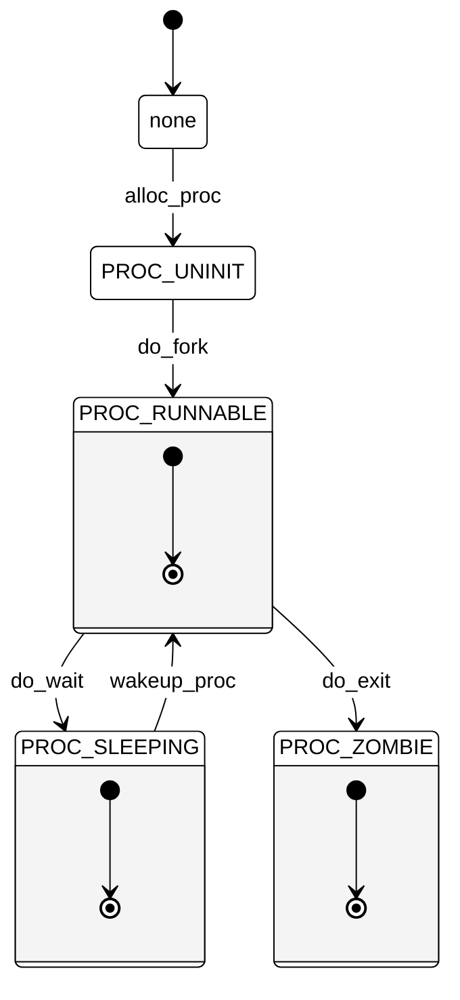

# lab5报告：用户进程管理与系统调用实现

---

## 目录

- [lab5报告：用户进程管理与系统调用实现](#lab5报告用户进程管理与系统调用实现)
  - [目录](#目录)
  - [实验目的](#实验目的)
  - [实验内容](#实验内容)
  - [练习0：填写已有实验](#练习0填写已有实验)
      - [修改内容](#修改内容)
      - [修改效果](#修改效果)
  - [练习1：加载应用程序并执行](#练习1加载应用程序并执行)
      - [代码修改](#代码修改)
      - [代码修改分析](#代码修改分析)
      - [执行过程描述](#执行过程描述)
  - [练习2：父进程复制自己的内存空间给子进程](#练习2父进程复制自己的内存空间给子进程)
      - [修改内容](#修改内容-1)
      - [修改效果](#修改效果-1)
  - [练习3：进程管理系统调用分析](#练习3进程管理系统调用分析)
    - [fork/exec/wait/exit执行流程分析](#forkexecwaitexit执行流程分析)
      - [函数分析](#函数分析)
      - [执行流程](#执行流程)
      - [生命周期图](#生命周期图)
  - [扩展练习：实现Copy on Write机制](#扩展练习实现copy-on-write机制)
  - [知识点分析](#知识点分析)

---

## 实验目的

- 理解第一个用户进程的创建过程
- 掌握系统调用框架的实现机制
- 理解uCore如何通过`sys_fork`、`sys_exec`、`sys_exit`、`sys_wait`等系统调用实现进程管理

## 实验内容

实验5旨在创建用户进程，使其在用户态执行，并通过系统调用让uCore提供必要的服务。具体任务包括：

- 构造第一个用户进程
- 实现并支持通过系统调用进行进程管理
- 完成用户进程的基本执行与管理

主要改动涉及以下目录和文件：

- **kern/debug/**
  - `kdebug.c`：解析用户进程的符号信息表示
- **kern/mm/**
  - `memlayout.h`、`pmm.[ch]`、`vmm.[ch]`等：管理用户进程的内存空间
- **kern/process/**
  - `proc.[ch]`：扩展进程结构和相关函数
- **kern/trap/**
  - `trap.c`：设置系统调用的中断门
- **user/**
  - 新增用户程序和用户库


## 练习0：填写已有实验

**要求**：

- 将实验2/3/4中的代码填入本实验中标注为“LAB2”/“LAB3”/“LAB4”的部分。
- 根据lab5的测试要求，对已有代码进行必要的改进，确保测试程序能够正确执行。


#### 修改内容

1. **在`alloc_proc`函数中添加额外的初始化**

   为了正确管理进程之间的关系，需要在`alloc_proc`函数中初始化新的成员变量。这些变量包括：

   - `wait_state`：表示进程的等待状态。
   - `cptr`（Child Pointer）：指向当前进程的子进程。
   - `optr`（Older Sibling Pointer）：指向当前进程的上一个兄弟进程。
   - `yptr`（Younger Sibling Pointer）：指向当前进程的下一个兄弟进程。

   **修改代码如下：**

   ```c
   // alloc.c: static struct proc_struct *alloc_proc(void)
   alloc_proc(void) {
       struct proc_struct *proc = kmalloc(sizeof(struct proc_struct));
       if (proc != NULL) {
           // Existing initialization code
           proc->state = PROC_UNINIT;
           proc->pid = -1;
           proc->runs = 0;
           proc->kstack = 0;
           proc->need_resched = 0;
           proc->parent = NULL;
           proc->mm = NULL;
           memset(&(proc->context), 0, sizeof(struct context));
           proc->tf = NULL;
           proc->cr3 = boot_cr3;
           proc->flags = 0;
           memset(proc->name, 0, PROC_NAME_LEN);
           
           // LAB5: 添加新的初始化
           proc->wait_state = 0;
           proc->cptr = NULL; // Child Pointer 表示当前进程的子进程
           proc->optr = NULL; // Older Sibling Pointer 表示当前进程的上一个兄弟进程
           proc->yptr = NULL; // Younger Sibling Pointer 表示当前进程的下一个兄弟进程
       }
       return proc;
   }
   ```

   **修改说明：**

   - 初始化`wait_state`为`0`，表示当前进程没有处于等待状态。
   - 将`cptr`、`optr`和`yptr`初始化为`NULL`，确保新创建的进程在进程链表中没有关联的子进程或兄弟进程。

2. **在`do_fork`函数中修改代码**

   在`do_fork`函数中，需要对新创建的子进程进行进一步的初始化和设置，包括设置父进程指针、进程关系链以及分配唯一的进程ID。

   **修改代码如下：**

   ```c
   // dofork:int do_fork(uint32_t clone_flags, uintptr_t stack, struct trapframe *tf)
   do_fork(uint32_t clone_flags, uintptr_t stack, struct trapframe *tf) {
       int ret = -E_NO_FREE_PROC;
       struct proc_struct *proc;
       
       if (nr_process >= MAX_PROCESS) {
           goto fork_out;
       }
       ret = -E_NO_MEM;
       
       // LAB4:EXERCISE2 YOUR CODE
       /*
        * 调用 alloc_proc 分配一个新的进程结构
        */
       if((proc = alloc_proc()) == NULL) {
           goto fork_out;
       }
       
       // LAB5: 更新 LAB4 步骤
       proc->parent = current; // 设置新进程的父进程为当前进程
       assert(current->wait_state == 0); // 确保当前进程不处于等待状态
       
       if(setup_kstack(proc) != 0) { // 分配内核栈
           goto bad_fork_cleanup_proc;
       }
       
       if(copy_mm(clone_flags, proc) != 0) { // 复制或共享内存空间
           goto bad_fork_cleanup_kstack;
       }
       
       copy_thread(proc, stack, tf); // 设置新进程的trapframe和上下文
       
       bool intr_flag;
       local_intr_save(intr_flag);
       {
           proc->pid = get_pid(); // 分配唯一的进程ID
           hash_proc(proc); // 将新进程加入进程哈希表
           set_links(proc); // 设置进程之间的关系链
       }
       local_intr_restore(intr_flag);
       
       wakeup_proc(proc); // 将新进程状态设置为可运行
       ret = proc->pid; // 返回新进程的PID
       
   fork_out:
       return ret;
   
   bad_fork_cleanup_kstack:
       put_kstack(proc);
   bad_fork_cleanup_proc:
       kfree(proc);
       goto fork_out;
   }
   ```

   **修改说明：**

   - **设置父进程指针**：`proc->parent = current;` 将新进程的父进程指针指向当前进程，确保进程树的正确性。
   - **断言父进程的等待状态**：`assert(current->wait_state == 0);` 确保父进程在创建子进程时不处于等待状态，以避免资源竞争和死锁。
   - **分配内核栈**：调用`setup_kstack(proc)`为新进程分配内核栈。如果分配失败，进行相应的错误处理。
   - **复制或共享内存空间**：调用`copy_mm(clone_flags, proc)`根据`clone_flags`的不同选择复制或共享父进程的内存空间。
   - **设置trapframe和上下文**：调用`copy_thread(proc, stack, tf)`设置新进程的trapframe和上下文，以便新进程能够正确执行。
   - **分配唯一的PID并加入进程哈希表**：
     - `proc->pid = get_pid();` 为新进程分配一个唯一的进程ID。
     - `hash_proc(proc);` 将新进程加入进程哈希表，便于后续的进程管理和查找。
   - **设置进程关系链**：调用`set_links(proc)`设置新进程与其他进程之间的关系链（如兄弟进程链表）。
   - **唤醒新进程**：调用`wakeup_proc(proc)`将新进程的状态设置为可运行，等待调度器调度执行。
   - **错误处理**：在内核栈或进程结构分配失败的情况下，进行相应的资源释放，确保系统稳定性。


#### 修改效果

通过上述修改，实验5中的进程创建过程得到了完善：

- **进程结构的完整初始化**：在`alloc_proc`中初始化了新的成员变量，确保进程之间的关系链能够正确维护。
- **父子进程关系的建立**：在`do_fork`中设置了子进程的父进程指针，并通过`set_links`函数维护进程之间的兄弟关系。
- **唯一PID的分配与管理**：通过`get_pid`和`hash_proc`确保每个进程拥有唯一的PID，并能在系统中被有效管理和查找。
- **内核栈与内存空间的正确分配**：确保新进程拥有独立的内核栈和正确的用户内存空间，避免进程间的资源冲突。


---

## 练习1：加载应用程序并执行
**要求**：do_execv函数调用load_icode（位于kern/process/proc.c中）来加载并解析一个处于内存中的ELF执行文件格式的应用程序。你需要补充load_icode的第6步，建立相应的用户内存空间来放置应用程序的代码段、数据段等，且要设置好proc_struct结构中的成员变量trapframe中的内容，确保在执行此进程后，能够从应用程序设定的起始执行地址开始执行。需设置正确的trapframe内容。


#### 代码修改

为了实现加载应用程序并执行，我们对`load_icode`函数进行了如下修改，下面的代码添加在函数的第六步：

1. **设置用户栈指针 (`sp`)**：
   
   将用户进程的栈指针 (`sp`) 设置为用户栈的顶端 (`USTACKTOP`)，确保用户进程有足够的栈空间进行函数调用和局部变量的存储。
   
   ```c
   tf->gpr.sp = USTACKTOP;
   ```

2. **设置程序入口点 (`epc`)**：
   
   将程序的入口点 (`epc`) 设置为ELF文件的入口地址 (`elf->e_entry`)，确保CPU在返回用户态时能够从正确的位置开始执行应用程序的第一条指令。
   
   ```c
   tf->epc = elf->e_entry;
   ```

3. **设置状态寄存器 (`sstatus`)**：
   
   配置状态寄存器中的`SPP`位和`SPIE`位：
   
   - **清零`SPP`位**：表示异常来自用户态。
   - **清零`SPIE`位**：表示不启用中断。
   
   这些设置确保在用户态和内核态之间的切换能够正确进行，且用户态进程在执行过程中不会被不必要的中断打断。
   
   ```c
   tf->status = sstatus & ~(SSTATUS_SPP | SSTATUS_SPIE);
   ```
#### 代码修改分析

通过上述修改和执行过程的描述，可以看出以下关键点：

- **内存映射与页面分配**：
  
  `load_icode`函数负责将ELF格式的应用程序加载到用户进程的内存空间中，包括代码段、数据段以及BSS段的内存分配和初始化。

- **用户栈与入口点配置**：
  
  设置用户栈指针 (`sp`) 和程序入口点 (`epc`) 是确保用户进程能够正确开始执行的关键步骤。这些设置使得在从内核态切换回用户态时，CPU能够从正确的位置和栈状态开始执行应用程序。

- **状态寄存器配置**：
  
  通过设置`SSTATUS_SPP`和`SSTATUS_SPIE`位，确保用户进程在切换回用户态时具有正确的中断和权限配置，避免不必要的权限提升或中断处理问题。


通过对`load_icode`函数的修改，实现了以下效果：

- **正确的用户进程初始化**：
  
  用户进程的栈指针和程序入口点被正确设置，确保进程能够从用户态开始执行。

- **状态寄存器配置的准确性**：
  
  通过配置`SSTATUS`寄存器中的关键位，确保用户进程在执行过程中具备正确的权限和中断配置。

- **内存空间的正确映射与初始化**：
  
  应用程序的各个段（代码段、数据段、BSS段）被正确加载到用户进程的内存空间中，确保应用程序能够正常运行。

这些修改确保了用户进程的正确加载与执行，为后续的进程管理和系统调用提供了可靠的基础。


#### 执行过程描述

用户态进程从被uCore选择占用CPU（进入RUNNING态）到执行第一条指令的过程如下：

1. **创建并唤醒线程**：
   
   在`init_main`中，通过`kernel_thread`调用`do_fork`创建并唤醒一个新线程，该线程执行函数`user_main`。此时，该线程的状态已设置为`PROC_RUNNABLE`，表示该线程已准备好运行。

2. **执行`user_main`**：
   
   在`user_main`函数中，通过宏`KERNEL_EXECVE`调用`kernel_execve`，启动用户进程的执行。

3. **触发断点异常**：
   
   在`kernel_execve`中执行`ebreak`指令，触发断点异常，进入异常处理流程。异常处理流程转到`__alltraps`，再跳转到`trap`，随后进入`trap_dispatch`，最终在`exception_handler`中处理`CAUSE_BREAKPOINT`。

4. **系统调用处理**：
   
   在`CAUSE_BREAKPOINT`处调用`syscall`函数，系统调用根据参数确定执行`sys_exec`，进一步调用`do_execve`函数。

5. **加载应用程序**：
   
   在`do_execve`中调用`load_icode`函数，加载用户应用程序的ELF文件内容到当前进程的内存空间中。

6. **返回用户态执行**：
   
   应用程序加载完毕后，控制权一路返回到`__alltraps`的末尾，接着执行`__trapret`后的内容，通过`sret`指令退出内核态，切换回用户态，开始执行用户应用程序的第一条指令。


---
## 练习2：父进程复制自己的内存空间给子进程
**描述**：创建子进程的函数do_fork在执行中将拷贝当前进程（即父进程）的用户内存地址空间中的合法内容到新进程中（子进程），完成内存资源的复制。具体是通过copy_range函数（位于kern/mm/pmm.c中）实现的，请补充copy_range的实现，确保能够正确执行。


#### 修改内容

1. **修改 `copy_range` 函数**

   在 `kern/mm/pmm.c` 文件中，我们对 `copy_range` 函数进行了修改，以实现父进程内存空间的复制到子进程，并为COW机制做准备。具体修改如下：

   ```c
   uintptr_t* src = page2kva(page);
   uintptr_t* dst = page2kva(npage);
   memcpy(dst, src, PGSIZE);
   ret = page_insert(to, npage, start, perm);
   ```

   **修改说明**：

   - **获取内核虚拟地址**：
     
     ```c
     uintptr_t* src = page2kva(page);
     uintptr_t* dst = page2kva(npage);
     ```
     
     通过 `page2kva` 宏，将物理页转换为内核虚拟地址，分别获取源页面 (`src`) 和目标页面 (`dst`) 的内核虚拟地址。

   - **内存拷贝**：
     
     ```c
     memcpy(dst, src, PGSIZE);
     ```
     
     使用 `memcpy` 函数将源页面的内容复制到目标页面，确保子进程拥有父进程内存空间的完整副本。

   - **插入页表**：
     
     ```c
     ret = page_insert(to, npage, start, perm);
     ```
     
     调用 `page_insert` 函数，将复制后的页面插入到子进程的页表中，建立虚拟地址到物理地址的映射。


2. **实现 Copy on Write (COW) 机制**

   为了优化内存使用，在进程复制时，尝试引入了COW机制。其主要思想是在父子进程共享相同的物理内存页时，标记这些页面为只读。当任一进程尝试写入共享页面时，触发页面错误处理，通过复制页面来实现真正的写时复制。

   **COW设计步骤**：

   - **在 `fork` 时设置页面为只读**：
     
     在 `fork` 操作中，将父进程的所有页表项设置为只读，并在子进程的页表中复制这些只读页表项。这确保了父子进程共享相同的物理页面，且任何对共享页面的写操作都会触发页面错误。

   - **页面错误处理**：
     
     当子进程尝试修改共享页面时，会因为页面只读而触发页面错误。内核在处理该异常时，会分配一个新的物理页面，将原页面的内容复制到新页面，然后更新子进程的页表，使其指向新的可写页面。这样，子进程获得了该页面的私有副本，而父进程仍然保持对原页面的引用。

   - **引用计数管理**：
     
     为了跟踪每个物理页面被多少进程共享，我们维护了一个引用计数。当一个页面被多个进程共享时，引用计数递增；当一个进程释放该页面时，引用计数递减。当引用计数降为零时，释放该页面。


#### 修改效果

通过对 `copy_range` 函数的修改和COW机制的实现，实验5中的进程复制功能得到了优化和完善：

- **内存资源优化**：
  
  COW机制通过延迟实际的内存复制，减少了不必要的内存占用，提高了内存使用效率。

- **进程创建效率提升**：
  
  由于父子进程在初始阶段共享相同的物理页面，进程创建速度更快，尤其在大量进程创建时效果显著。

- **内存一致性保障**：
  
  通过页面错误处理和引用计数管理，确保了各进程对内存的独立访问和修改，避免了内存数据的不一致性问题。

- **系统稳定性增强**：
  
  正确的内存管理和错误处理机制，提高了系统的稳定性，避免了因内存资源管理不当导致的潜在问题。

这些改进不仅满足了实验要求，还为后续的内存管理和进程调度提供了坚实的基础。

---


## 练习3：进程管理系统调用分析
**描述**：请在实验报告中简要说明你对 fork/exec/wait/exit函数的分析。并回答如下问题：请分析fork/exec/wait/exit的执行流程。重点关注哪些操作是在用户态完成，哪些是在内核态完成？内核态与用户态程序是如何交错执行的？内核态执行结果是如何返回给用户程序的？请给出ucore中一个用户态进程的执行状态生命周期图（包执行状态，执行状态之间的变换关系，以及产生变换的事件或函数调用）。（字符方式画即可）
### fork/exec/wait/exit执行流程分析

| 系统调用 | 执行阶段 | 操作内容 |
|----------|----------|----------|
| `fork`   | 用户态与内核态 | 用户进程调用`fork`，内核通过`do_fork`创建子进程，复制父进程的上下文和内存空间。 |
| `exec`   | 用户态与内核态 | 用户进程调用`exec`，内核通过`do_execve`加载新程序，替换当前进程的内存空间。 |
| `wait`   | 用户态与内核态 | 用户进程调用`wait`，内核通过`do_wait`阻塞等待子进程结束，回收子进程资源。 |
| `exit`   | 用户态与内核态 | 用户进程调用`exit`，内核通过`do_exit`释放进程资源，唤醒父进程。 |


#### 函数分析

1. **`fork`**：通过发起系统调用执行`do_fork`函数，用于创建并唤醒一个新的子进程。
   
   - **初始化新进程**：
     - 调用`alloc_proc`分配一个新的进程结构体，并初始化其基本字段。
     - 为新进程分配内核栈空间，确保其有独立的内核栈。
     - 根据`clone_flags`决定是复制还是共享父进程的虚拟内存空间，调用`copy_mm`实现。
     - 设置新进程的上下文和中断帧，确保新进程能够从正确的状态开始执行。
   
   - **进程链表管理**：
     - 将新进程插入进程哈希表和进程链表中，方便后续的进程管理与调度。
     - 分配唯一的进程ID (`pid`) 给新进程，并返回该`pid`作为`fork`的返回值。
   
   - **唤醒新进程**：
     - 调用`wakeup_proc`将新进程的状态设置为`PROC_RUNNABLE`，使其进入就绪队列，等待调度器调度执行。


2. **`exec`**：通过发起系统调用执行`do_execve`函数，用于替换当前进程的内存空间，加载并执行一个新的用户程序。
   
   - **回收旧内存空间**：
     - 如果当前进程已有虚拟内存空间 (`mm`)，则调用`exit_mmap`、`put_pgdir`和`mm_destroy`释放现有的内存资源。
   
   - **加载新程序**：
     - 调用`load_icode`函数将新的ELF格式的用户程序加载到当前进程的内存空间中，设置用户栈、入口点以及状态寄存器。
     - 更新进程名称为新的程序名称，确保进程标识的正确性。


3. **`wait`**：通过发起系统调用执行`do_wait`函数，用于等待子进程的结束，并回收子进程的资源。
   
   - **查找子进程**：
     - 根据传入的`pid`查找指定的子进程，或者遍历所有子进程查找处于`PROC_ZOMBIE`状态的子进程。
   
   - **等待与唤醒**：
     - 如果有子进程处于`PROC_ZOMBIE`状态，则回收其资源并返回。
     - 如果没有可回收的子进程，则将当前进程状态设置为`PROC_SLEEPING`，并调用`schedule`进行调度，等待子进程结束。
   
   - **资源回收**：
     - 从进程哈希表和进程链表中移除子进程，并释放其内核栈和进程结构体资源。


4. **`exit`**：通过发起系统调用执行`do_exit`函数，用于终止当前进程，并回收其资源。
   
   - **内存资源回收**：
     - 如果当前进程拥有虚拟内存空间，则调用`exit_mmap`、`put_pgdir`和`mm_destroy`释放内存资源。
   
   - **设置进程状态**：
     - 将当前进程的状态设置为`PROC_ZOMBIE`，表示进程已经结束，但其资源尚未被父进程回收。
     - 将进程的退出码 (`exit_code`) 记录下来，以便父进程通过`wait`获取。
   
   - **唤醒父进程**：
     - 如果父进程处于等待子进程结束的状态 (`WT_CHILD`)，则唤醒父进程，通知其可以回收子进程资源。
   
   - **调度切换**：
     - 调用`schedule`函数切换到其他可运行的进程，确保系统的进程调度继续进行。


#### 执行流程

系统调用部分在内核态进行，用户程序的执行在用户态进行。以下是从用户态发起系统调用到内核态处理，再返回用户态执行的详细流程：

1. **系统调用发起**：
   
   用户程序通过系统调用接口（如`sys_fork`、`sys_exec`、`sys_wait`、`sys_exit`）发起系统调用，触发`ebreak`指令，导致陷入异常，切换到内核态。

2. **内核态处理**：
   
   - **异常处理**：
     - 异常处理函数`__alltraps`接管控制权，跳转到`trap`处理函数。
     - `trap_dispatch`根据异常类型调用相应的处理函数，如`exception_handler`。
   
   - **系统调用处理**：
     - 在`CAUSE_BREAKPOINT`处调用`syscall`函数，根据传入的系统调用编号执行对应的内核函数（如`do_fork`、`do_execve`等）。
   
   - **函数执行**：
     - 执行具体的系统调用函数，完成进程创建、程序执行、等待子进程、进程退出等操作。

3. **返回用户态**：
   
   - **设置trapframe**：
     - 系统调用处理完成后，通过`kernel_execve_ret`等函数将处理结果存储到进程的trapframe中。
   
   - **状态切换**：
     - 使用`sret`指令从内核态返回到用户态，继续执行用户程序的后续指令。

4. **用户态执行**：
   
   用户程序从上次中断的地方继续执行，基于系统调用的返回值进行后续操作。

#### 生命周期图

以下是uCore中一个用户态进程的执行状态生命周期图，展示了进程从创建到终止的各个状态及其转换关系：

<center>



</center>

**状态说明**：


- **PROC_UNINIT**：进程结构体初始化完成，准备进入就绪状态。
- **PROC_RUNNABLE**：进程处于就绪队列，等待被调度执行。
- **PROC_SLEEPING**：进程由于等待资源或事件而被挂起。
- **PROC_ZOMBIE**：进程已经终止，但其资源尚未被父进程回收。
- **PROC_WAITING**：进程正在等待子进程结束。
- **EXIT**：进程资源被完全回收，生命周期结束。


## 扩展练习：实现Copy on Write机制

**描述**：实现 Copy on Write （COW）机制。


## 知识点分析


| 实验知识点 | 对应OS原理知识点 | 含义与关系 |
|------------|-------------------|------------|
| 用户进程创建与管理 | 进程管理 | 实验通过实现`fork`、`exec`等系统调用，深入理解进程的创建、执行与终止过程。 |
| 系统调用机制 | 系统调用接口 | 实验展示了用户态与内核态的交互，通过系统调用实现用户进程与内核服务的通信。 |
| 内存管理（虚拟内存、页表） | 内存管理 | 实验涉及用户内存空间的分配、复制及Copy on Write机制，体现了虚拟内存和页表的实际应用。 |
| Copy on Write (COW) | 内存共享与优化 | 实验通过实现COW机制，优化内存使用，理解内存共享与写时复制的原理。 |


- **进程间通信（IPC）**：如管道、消息队列、信号量等。
- **线程管理**：包括多线程的调度与同步机制。
- **高级内存管理技术**：如内存分页算法、交换空间管理等。
- **调度算法的深入实现**：如多级反馈队列、实时调度等。
- **文件系统管理**：实验主要集中于进程和内存，未涉及文件系统的实现与管理。


---